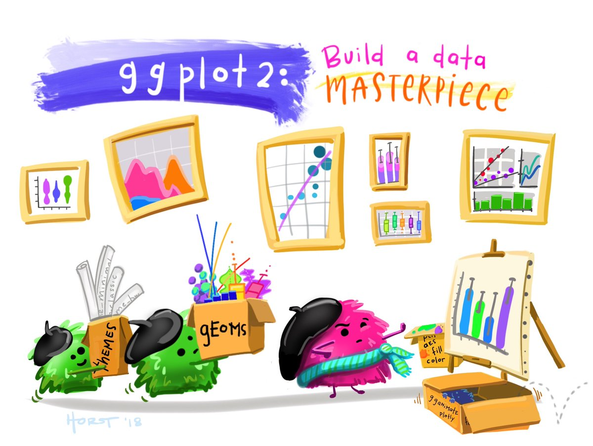

```{r setup, include=FALSE}
knitr::opts_chunk$set(fig.width=6, fig.asp = 0.618, collapse=TRUE) 
knitr::opts_chunk$set(echo = TRUE, warning=FALSE)
```


### Unit 3: Penguins
#### Lesson 2: Intro to ggplot (data visualization)
#### New functions: 
find(), ggplot(), geom_point(), geom_smooth(), geom_line(), geom_histogram(), geom_boxplot(), geom_jitter(), geom_bar(), facet_wrap(), coord_flip(), scale_fill_manual(), xlab(), ylab(), ggtitle(), ggsave(), colors(), theme_bw()

***

### ggplot2: visualizing data in the tidyverse

Now we will learn how to visualize your data using `ggplot2.` R has several systems for making graphs, but `ggplot2` is one of the most elegant and most versatile. You can do more faster by learning one system and applying it to many different types of figures. Once you have gone through the basics, it can be helpful to look at a ggplot cheat sheet to remind yourself about functionality and syntax or to learn more. To download a cheat sheet, in RStudio, go to the toolbar at the top `Help -> Cheatsheets -> Data Visualization with ggplot2`. 

{width=50%}

To use `ggplot2`, we start by loading the `tidyverse.` Note again, that you could just load the package `ggplot2` and that would also give you access to all of the `ggplot2` functions. However, by loading the `tidyverse` we can get ggplot2 and dplyr loaded at the same time (as well as some other packages that data scientists frequently like to use). Let's also load up our Antarctic penguins dataset:

```{r}
library(palmerpenguins)
library(tidyverse)
```

### Note about namespaces:

It's worth noting the messages and warnings that you get when you load in a package. In this case, we see that we are actually loading a series of packages, and all of the package versions are listed. There is also a warning about conflicts. Conflicts occur in your function namespace when you have libraries loaded with functions that have the exact same name as functions in other libraries that you loaded, or in base R. For example, there is a `filter()` function in the R `stats` package (which is automatically loaded as part of base R). There is also a `filter()` function in `dplyr`, which we used in the previous lesson. This unfortunately creates some confusion because now you may not be sure which filter() function you are actually using.

If two packages use the same function name, then the package loaded last will hide the function from earlier packages. This is called *masking*. When masking occurs and you're not sure which package you loaded last, you can use the find() function to figure out which package the function you are using is pulled from. If multiple package names are returned, the first package returned in the vector will be the one that is used by default. 

```{r}
find("filter")
```

Let's say you actually wanted to use the `stats` package version of filter. You can specify exactly what namespace to use in front of the function like this:

```{r, eval=FALSE}
stats::filter
```

In many of my scripts, I use `dplyr`'s `select()` function to choose which columns I am interested in keeping. However, one of the other packages I frequently use also has a `select()` function, so I need to specify the dplyr package before calling `select()`:

```{r}
species_islands = penguins %>% dplyr::select(species, island)
```

If you are getting unexpected behavior or output and you've triple checked your code, it may be that you aren't using the function you thought you were due to masking. For more ideas on how to handle conflicts, check out this page on stack overflow: <https://stackoverflow.com/questions/61016791/whats-the-best-way-to-work-around-function-name-conflicts-in-r>

### Scatterplot

With `ggplot2`, you begin a plot with the function `ggplot()`. `ggplot()` creates a coordinate system that you can add layers to. The first argument of `ggplot()` is the dataset to use in the graph. So `ggplot(data = penguins)` creates an empty graph, but it’s not very interesting so I’m not going to show it here:

```{r, eval=FALSE}
ggplot(data=penguins)
```

You complete your graph by adding one or more layers to `ggplot()` with the addition operator `+`. The function `geom_point()` adds a layer of points to your plot, which creates a scatterplot. `ggplot2` comes with many geom functions that each add a different type of layer to a plot. We’ll learn a whole bunch of them throughout this lesson

Each geom function in `ggplot2` takes a mapping argument. The visual properties in the plot are mapped onto your dataset using the aesthetics mapping function `aes()` inside of the geom function. That's a fancy way of saying you use `aes()` to choose which variable in the data you want to be plotted along the x axis, and which variable you want to be plotted along the y axis. 

Let's use `ggplot2` to visualize the relationship between penguin body mass and penguin flipper length. But before we do anything, let's take a peek at the data to remind ourselves of the variable names and types. I usually use `head()` or `summary()`, but `glimpse()` is another function for peeking at your data that comes in the tidyverse:

```{r}
glimpse(penguins)
```

Now that I remember my variable names, let's build a scatterplot:

```{r, warning=TRUE}
ggplot(data=penguins) + 
  geom_point(aes(x=flipper_length_mm, y=body_mass_g))
```

Great! So as penguin mass goes up, so does the flipper length. Seems reasonable to me. We also got a helpful warning that 2 values were missing. That's probably because we have `NA`s in our data. We can easily check that by printing out a summary of our data:

```{r}
summary(penguins)
```

Or, if we wanted to check it more explicitly, we could count the `NA`s using `dplyr` like this:

```{r}
penguins %>%
  filter(is.na(body_mass_g)) %>% # Keep only values that are NA
  summarize(n_na = n())  # Count the NAs
```

The default strategy in `ggplot2` is to warn me that there are `NA`s, but plot my data anyways and just leave out the observations that are missing. That works for me. 

I wonder how the mass / flipper length relationship plays out for the three different penguin species? We can easily visualize this by making the same plot, but mapping the `color` aesthetic to species:

```{r}
ggplot(data=penguins) + 
  geom_point(aes(x=flipper_length_mm, y=body_mass_g, color=species))
```

We can even change the point shape to correspond with the species, so that this figure will work in color or black-and-white prints:

```{r}
ggplot(data=penguins) + 
  geom_point(aes(x=flipper_length_mm, y=body_mass_g, color=species, shape=species))
```

Or we can set the point shape to tell us the sex of the penguin:

```{r}
ggplot(data=penguins) + 
  geom_point(aes(x=flipper_length_mm, y=body_mass_g, color=species, shape=sex))
```

Ok, so the mass vs. flipper length relationship looks pretty similar across all three species, but Gentoo penguins are bigger than Adelie and Chinstrap. That's a handy little color legend that `ggplot` made for us automatically, but every part of the legend can be customized if you need it to be. 

That's a nice relationship between flipper length and size, where heavy birds have longer flippers. We'll learn how to run stats and models to explicitly examine the relationship between variables at a later time. However, we can use `geom_smooth()` to add in a simple smoother line to help guide our eye to see the relationship between these two variables. We'll do this by adding `geom_smooth()` as just another layer to our `ggplot`:

```{r}
ggplot(data=penguins) + 
  geom_point(aes(x=flipper_length_mm, y=body_mass_g, color=species)) +
  geom_smooth(aes(x=flipper_length_mm, y=body_mass_g))
# loess stands for locally estimated scatterplot smoothing
```

Now let's make the same scatterplot, but customize the x- and y-axis labels, and add a title to the plot. We can do this by adding more layers to our ggplot() call:

```{r}
ggplot(data=penguins) + 
  geom_point(aes(x=flipper_length_mm, y=body_mass_g, color=species)) + 
  xlab("Flipper length (mm)") +
  ylab("Body mass (g)") +
  ggtitle("Penguins are cute")
```

Not bad!

***

### Exercise 2.1

Build a scatter plot of bill depth vs. bill length for Adelie penguins. Map the point colors to the island that the Adelie penguin was observed on. Add axes labels and a main title. 

***

### Line graph

In this penguin dataset, data were only collected in 2007-2009, so there is a very short time series here. Still, I wonder how many penguins of each species were caught in each year. We can use dplyr to group our data set by year and species, then use summarize() with the n() function to count penguin observations within each group. Then it's as simple as plotting our new summary dataset as lines using geom_line(), much the same way we used geom_point() earlier:

```{r}
# Count number of observations per species per year
penguin_ts = penguins %>%
  group_by(species, year) %>%
  summarize(n=n())
                
ggplot(data=penguin_ts) +
  geom_line(aes(x=year, y=n, color=species))
```

Okay, great. Although there are fewer Chinstrap observations compared to Adelie and Gentoo, variation in observations don't seem to change too dramatically over time for any of the three species. That should help us rule out gross changes in environmental conditions when we are trying to understand the distribution of our variables.

### Histogram

I don't really know that much about penguins. For example, how long is a penguin beak? Like a couple of centimeters? Let's plot a quick histogram and get a sense of the data:

```{r}
ggplot(penguins) + 
  geom_histogram(aes(x=flipper_length_mm))
```

`ggplot` got grumpy and sent me a message that they set a default number of 30 bins for my histogram, but it would be a better practice to pick a `binwidth.` So I'll plot a histogram again, but this time, I'll set `binwidth=2` so that flippers within 2mm are put into the same histogram bin. 

Also, our histogram probably has 2 peaks because the 2 smaller species are on the left and those big Gentoos are on the right. I'm just going to quickly filter the data right in the plot call to look at just the Gentoo penguin flipper length histogram:

```{r}
ggplot(penguins %>% filter(species=="Gentoo")) + 
  geom_histogram(aes(x=flipper_length_mm), binwidth=2)
```

As I expected, that looks a bit more normal. 

I also could have colored the histogram bars by species. If I used the `color` aesthetic, that would just outline the feature with color. Instead, I'll use the `fill` aesthetic to fill the bars in with color. Since I am interested in seeing flipper length histograms for all three species, I'm also going to change the bin positions from "stack" (the default) to "identity" so that bins for each species can overlap each other. By specifying `alpha = 0.5` in my `geom_histogram` function, I am asking the bar colors to be somewhat transparent, that way I can see if multiple colors are overlapping. Finally, instead of just going with the default fill colors, I'm going to add another layer `scale_fill_manual` to specify the exact colors I want to use. 

```{r}
ggplot(data = penguins) +
  geom_histogram(aes(x = flipper_length_mm, fill = species), alpha = 0.5, binwidth=5, position="identity") +
  scale_fill_manual(values = c("darkorange","darkorchid","cyan4"))
```

Now it's pretty clear to see that the data represent three normal-ish distributions of flipper length, accounting for the three different species. 

### Box plots (and jittered points)

Perhaps a more intuitive way to look at the spread of flipper length data between the three species is with boxplots. We can use `geom_boxplot()` to make simple boxplots which compactly display the distribution of a continuous variable. It visualises five summary statistics (the median, two hinges and two whiskers), and all "outlying" points individually. The lower and upper hinges correspond to the first and third quartiles (the 25th and 75th percentiles). The whiskers extend from the hinge to the largest value no further than 1.5 * IQR from the hinge (where IQR is the inter-quartile range, or distance between the first and third quartiles). 

Personally, I like the combination of seeing the summary statistics of a boxplot along with the actual data plotted on top. To add the flipper length observations to our boxplots, we can use `geom_jitter()`, which plots the data with a jitter (random incremental change in position) so that you can easily see points that may have fallen right on top of each other. 

```{r}
ggplot(penguins) + 
  geom_boxplot(aes(y = flipper_length_mm, x = species)) +
  geom_jitter(aes(y = flipper_length_mm, x = species, color = species), width = 0.2) 
```

### Bar charts

Let's build a couple of bar charts using `geom_bar` to help us get to know our data better. We can visualize the number of observations of each sex for the three different species to determine whether male and female penguins were sampled evenly:

```{r}
ggplot(data = penguins) +
  geom_bar(aes(x = sex, fill = species)) 
```

So these stacked bar charts show me that the number of males and females observed across all three species is pretty even, and there are relatively few NAs so the sex of most penguins could be identified. However, I think I would be able to interpret the figure easier if the bars were not stacked on top of each other, and if each species had it's own separate plot. The function `facet_wrap` in ggplot is a great tool for taking whatever plot you are making and splitting it into several plots according to another variable:

```{r}
ggplot(data = penguins) +
  geom_bar(aes(x = sex, fill = species)) +
  facet_wrap(~species, nrow = 1)  # Create a new plot for each species, line them all up into 1 row
```

Great. ggplot split our sex barplots into 3 separate figures, 1 for each species, and it automatically labeled the figures. This makes is really easy to see the sex distribution for each species as well as the total count across species. Bravo!

Let's make a similar set of bar plots, but this time let's visualize how many penguins of each species were observed at each of the three islands in the study. We'll use `facet_wrap()` again, since this made the information very digestible. However, since the island names are long and may not fit super nicely along the x-axis, let's try plotting the bar charts on their sides using `coord_flip()`:

```{r}
ggplot(penguins) +
  geom_bar(aes(x = island, fill = species)) +
  facet_wrap(~species, ncol = 1) +
  coord_flip()
```

Now I can easily see that Adelie were found on three islands, but Gentoo and Chinstrap were each only found on one island. That's pretty important background information if I'm going to run an analysis on these penguins. When working with new data, it's really smart to visualize it in many different ways to get to know the distributions, what's missing, and the general idiosyncracies of the dataset. Some of your exploratory graphs may be useful to put into a presentation when you are sharing your data with a group. Occasionally, these data graphs may even be important enough to publish in the papers you write.

### Saving ggplots

Since I found the species observation distribution across the three islands a bit surprising, I'm going to save this graph so that I can refer back to it later. I can do this by calling the `ggsave()` function to write out the last plot I created:

```{r}
ggplot(penguins) +
  geom_bar(aes(x = island, fill = species)) +
  facet_wrap(~species, ncol = 1) +
  coord_flip()
ggsave(filename = "figures/penguin_species_per_island.png",  
       device = "png", width = 5, height = 4, units = "in", dpi = 300)
```

For this figure, I decided to save it as a `.png`, and I provided a width and height for the figure in units of inches. I also specified that I wanted the output to have a high resolution of 300 dots per inch. I didn't need to include that since `dpi=300` is the default, but now you see how to change it. Note, I also didn't need to specify "png" for the device because ggplot would have been smart enough to notice that my file name ends in ".png". I was just being very explicit here.

There are tons of options for saving your figures, and you can look through the ggsave() documentation to learn more. (Remember, do this by clicking on the `Help` tab in the lower-right hand pane of RStudio and typing `ggsave` into the search bar, or simply type `?ggsave` into the console).

I often save my figures as `.png` files because they have "lossless compression". That means that when I import my `.png` figures into a powerpoint and then move my powerpoint onto a different device (such as loading it onto large conference software before presenting at AGU), I don't wind up with crappy low-resolution figures. I have been burned in the past for embedding `.jpg` or `.pdf` figures. However, if I want to bring a saved figure into a different type of software for additional editing (like Adobe Illustrator), I like to save my original figures as `.pdf` because it can be easier to interact with distinct features of the graph, change fonts, etc.

### Colors

If you want a list of the named colors in R, you can use the function colors():

```{r, eval=FALSE}
colors()
```

I won't print it here because it's long. There are additional R packages and crafted color palettes available to meet whatever your aesthetic needs are. We won't dive into the nitty gritty of color options, but here is a great cheat sheet that broadly lays out a lot of the color options available in R:

https://www.nceas.ucsb.edu/sites/default/files/2020-04/colorPaletteCheatsheet.pdf

### Customizing aesthetics

I used the `scale_fill_manual()` function earlier so that I could choose the exact colors that I wanted to fill in the bars of my histogram. There is a lot of functionality in `ggplot2` (check the documentation). If you are asking yourself, "Can I change something very specific about how this figure looks?", chances are, you can. In fact, there is a whole suite of functions in ggplot that start with "scale_" followed by an aesthetic (x, y, color, fill, etc.) that you are trying to customize. Look at the `ggplot2` cheat sheet to get a quick sense of the broad functionality.

### Themes

You can customise the non-data elements of your plot with a theme. `ggplot2` includes eight themes by default (shown below), and many more are included in add-on packages like `ggthemes`.

{width=50%}

For example, we can recreate our first scatterplot with the black and white theme:

```{r}
ggplot(penguins) + 
  geom_point(aes(x=flipper_length_mm, y=body_mass_g, color=species)) +
  theme_bw()
```

It’s also possible to control individual components of each theme, like the size and colour of the font used for the y axis.

***

### Exercise 2.2

Build another scatter plot of bill depth vs. bill length for all three penguin species. Map the point colors to the penguin's sex. Use `facet_wrap()` to plot each species in a separate panel. Look at the documentation for `facet_wrap()` and play around with the `scales` parameter. What is the default value? Try plotting with the parameter `scales="free"`. Instead of using the default theme, choose a different pre-packaged theme (I like `theme_bw()` and `theme_classic()`). Save the plot.

***

### For more information

The best place to learn more is the ggplot2 book: [ggplot2: Elegant graphics for data analysis](https://ggplot2-book.org/). It goes into much more depth about the underlying theory, and has many more examples of how to combine the individual pieces to solve practical problems. 

Another great resource is the ggplot2 extensions gallery https://exts.ggplot2.tidyverse.org/gallery/. This site lists many of the packages that extend ggplot2 with new geoms and scales. It’s a great place to start if you’re trying to do something that seems hard with ggplot2.

***


