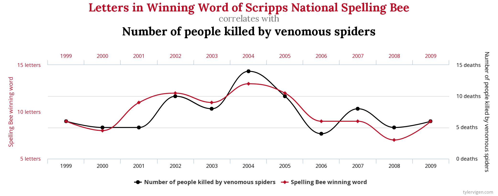

```{r setup, include=FALSE}
knitr::opts_chunk$set(fig.width=6, fig.asp = 0.618, collapse=TRUE) 
```

### Unit 3: Penguins
#### Lesson 4: Correlation
#### New functions: 
cor(), cor.test(), GGally::ggpairs()

***

### Correlation

In statistics, we can use correlation tests to evaluate the association between two or more variables. Pearson correlation (r),  measures a linear dependence between two variables (x and y). Pearson correlation is also known as a parametric correlation test because it depends on the distribution of the data. It can be used only when x and y are from a normal distribution. The plot of y = f(x) is named the linear regression curve.

If your data aren't normal, you can use Kendall tau and Spearman rho, which are rank-based correlation coefficients (non-parametric).

Let's see how bill length and bill depth relate to each other. This is what those two variables measure:

{width=30%}

We can start with a simple plot. For now, let's just look at our big Gentoo penguins:

```{r}
library(tidyverse)
library(palmerpenguins)
library(rstatix) # cor_test()

gentoo = penguins %>% 
  filter(species=="Gentoo")

# Exploratory data analysis:
glimpse(gentoo)
summarize(gentoo)
ggplot() +
  geom_point(aes(x=bill_length_mm, y=bill_depth_mm), data=gentoo)
```

As you probably expected, it seems like longer bill length typically corresponds with increased bill depth. We can check that our bill data looks pretty normal with a couple of Q-Q plots:

```{r}
# Check normality assumption with a qqplot:
ggplot(gentoo) +
  stat_qq(aes(sample=bill_length_mm))
ggplot(gentoo) +
  stat_qq(aes(sample=bill_depth_mm))
```

Alright, those Q-Q plots look fine, so we can move onto a correlation analysis guilt-free. What is the correlation between Gentoo penguin bill length and bill depth? We can use `cor()` to calculate Pearson's r correlation coefficient. There is an `NA` in the Gentoo bill data, so we have to handle the missing data with the `use` parameter in `cor()`, otherwise the function will throw an error. You can check the documentation (`?cor`) to see the options for the use parameter. Another option would be to filter `NAs` out of your data before running it through the correlation test. You'll also note that the default correlation method is Pearson's r, but if your data weren't normal, you can use the `method` parameter in `cor()` to run the Kendall or Spearman correlation tests with sorted data. 

```{r}
# cor() returns just the correlation coefficient r
cor(x=gentoo$bill_length_mm, y=gentoo$bill_depth_mm, use="complete.obs") # use param handles NAs

# cor.test() returns the t-statistic, df, p-value, etc.
cor.test(x=gentoo$bill_length_mm, y=gentoo$bill_depth_mm, use="complete.obs") # use param handles NAs

# cor_test is the pipe-friendly version from rstatix
gentoo %>%
  cor_test(bill_length_mm, bill_depth_mm) # use param handles NAs
```
Interpreting Pearson's r:

-  -1 indicates a strong negative correlation : this means that every time x increases, y decreases
-  0 means that there is no association between the two variables (x and y)
-  1 indicates a strong positive correlation : this means that y increases with x

So for bill length vs. bill depth, Pearson's r = 0.64. That's a pretty solid correlation coefficient - those two variables definitely have a (positive) linear relationship. From cor.test() we can see that the p-value is much less than 0.05, so the correlation is "significant". 

***

### Exercise 4.1

Calculate the correlation between bill length and bill depth with all 3 penguin species combined into a single data set. Is the correlation stronger or weaker compared to the correlation between bill length and bill depth for Gentoo penguins alone? Do you notice anything unexpected about this correlation?

***

### Correlation matrix

Let's say that we want to get a quick sense of how all of the variables relate to each other. Which penguin body measurements are most related? I can send multiple columns from our data.frame to `cor()` at once, and it will return a matrix with the correlations of each variable vs. all of the others:

```{r}
head(gentoo) # Check which columns would be interesting to include in the correlation matrix
cor(gentoo[,3:6], use="complete.obs")
```

Well everything looks related to me, but the strongest correlation is between body mass and bill depth. 

If you want to add more pizazz and flair to your correlation analysis (who doesn't?) you can use `ggpairs()` in the `GGally` package. `ggpairs()` will plot x-y scatterplots between variable pairs on the lower left-hand side of the plot matrix and print out correlation coefficients on the upper right hand side of the matrix. The matrix diagonal shows the density plot for each single variable (a density plot is like a histogram, but with a line instead of bars). This let's you handle quick data visualization, normality tests and a correlation analysis in a one-stop-shop.

```{r, fig.height = 6, fig.width = 8, message=FALSE, warning=FALSE}
library(GGally) # ggpairs()

# ggpairs(gentoo[,3:6])

gentoo %>%
  select(bill_length_mm, bill_depth_mm, flipper_length_mm, body_mass_g) %>%
  ggpairs()
```

If we wanted to be really fancy, we can run `ggpairs()` on the complete dataset rather than just the Gentoo penguins. To keep the species separated in our correlation matrix, we can map the species variable to a color:

```{r, fig.height = 7, fig.width = 9, message=FALSE, warning=FALSE}
penguins %>%
  select(species, body_mass_g, ends_with("_mm")) %>% # clever way to select variables with names that end in "_mm"
  GGally::ggpairs(aes(color = species))
```

That's a lot of information in one place. Every correlation presented in this matrix is significant (R shows this with the number of asterisks next to the correlation coefficient). That's not a huge surprise - why wouldn't different measurements on a bird's body be correlated? It seems like the correlation between body metrics is typically higher in Gentoo penguins than either Chinstrap or Adelie penguins. There's also a few relationships where the correlation of the pooled data (i.e. all three species) is negative, but each of the species-specific correlations for the same relationship is positive. This seems to be true for the relationship between bill depth and any of the other three body measurements. That's interesting, and something we'll look out for in our future statistical analyses of this dataset. 

### The golden rule: Correlation does not imply causation

Correlation doesn’t imply causation. In other words, if two variables have high correlation, it does not mean one variable ’causes’ the value of the other variable to increase. Correlation is only an aid to understand the relationship. For example:



It's tempting to try to figure out a mechanism though, isn't it?

***

### More information

Here is another fabulous (and free!) textbook that inspired this lesson, and that can be used as a resource for more information:

Statistical Inference via Data Science: A ModernDive into R and the Tidyverse!
By: Chester Ismay and Albert Y. Kim
<https://moderndive.com/index.html>
and the most updated version (2025)
<https://moderndive.com/v2/>

***
